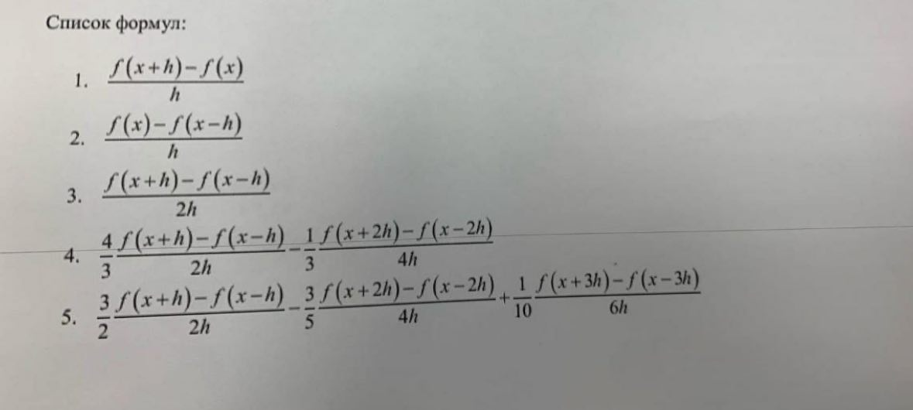

# Численное дифференцирование

Исследование абсолютной погрешности численного дифференцирования с шагом дифференцирования `h_n = 2 / 2^n`, где `n = 1..21`. для пяти методов приближённого вычисления производной функции:

Вычисления производились для функций:

- `sin(x^2)`
- `cos(sin(x))`
- `exp(sin(cos(x)))`
- `ln(x + 3)`
- `(x + 3)^0.5`

в точке `x0 = 1.3`.

## Результаты

Все изображения с графиками находятся в папке [`pictures/`](./pictures/).

## Анализ

1. Методы первого порядка (1, 2) демонстрируют медленное уменьшение ошибки при уменьшении шага, тогда как (3-5) обеспечивают гораздо более быстрое снижение погрешности.  

2. На каждом графике есть два разных участка: 
   - Справа (при больших `h`) - ошибка от неточности самой формулы.  
   - Слева (при маленьких `h`) - ошибка округления.

3. На графиках видно, что минимальная погрешность достигается при определённом значении h, после чего ошибка снова растёт.