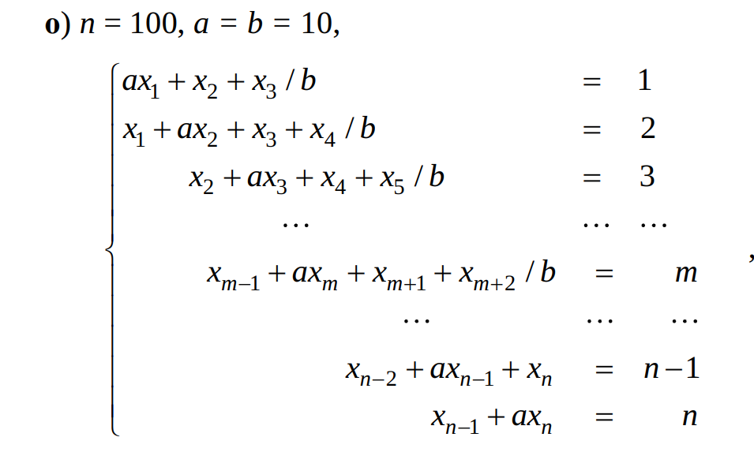

# Решение систем линейных алгебраических уравнений (СЛАУ)

Рассматривается решение системы линейных уравнений следующего вида:




## Структура проекта

| Файл | Исполнение |
|------|-------------|
| **generator.py** | Генерация матрицы `A` и вектора `b` для заданных параметров `n`, `a`, `b`. |
| **check_results.py** | Подсчёт абсолютной квадратичной нормы невязки \( \|A x - b\|_2 \). |
| **get_graphics.py** | Строит график зависимости убывания невязки от итерации и график сравнения 
| **gauss.py** | Реализация метода Гаусса с выбором главного элемента|
| **lu.py** |  Метод LU-разложения. |
| **jacobi.py** | Метод Якоби. |
| **seidel.py** | Метод Зейделя. |
| **upper_relaxation.py** | Метод верхней релаксации. |


## Запуск определённого метода

Для запуска любого метода используется команда:
```bash
python method_name.py
```

После запуска программа:

- Выводит имя используемого метода.

- Показывает значение абсолютной квадратичной нормы невязки

- Проверяет корректность решения.
Если норма невязки меньше 1e-12, выводится сообщение `Correct`.


Для итерационных методов строится график зависимости убывания невязки от номера итерации

Для получения всех графиков сразу (результат сохранен в **pictures/compare.png**):
```bash
python get_graphics.py
```

## Описание методов

### Метод Гаусса с выбором главного элемента (прямой метод)

На каждом шаге выбирается главный элемент - максимальный по модулю элемент во всей текущей подматрице.
Для всех остальных строк его столбец зануляется.

Далее главная строка и столбец исключаются из системы, и процесс повторяется, пока не останется один элемент.
После этого выполняется обратный ход для восстановления всех компонент вектора решения

### Метод LU-разложения (прямой метод)

- Разложение матрицы:
Вычисляется представление A = L · U (нижнетреугольная матрица с единицами на главной диагонали, верхнетреугольная матрица)

- Прямая подстановка:
Решается вспомогательная система L · z = b.

- Обратная подстановка:
Решается система U · x = z - находим вектор неизвестных x.

***Условия существования***

Матрица A должна быть обратимой.
Все ведущие главные миноры матрицы A должны быть невырождены.

### Метод Якоби (метод простой итерации)

Исходная система Ax = b переписывается в виде:

A = D + L + U,  
где  
- D - диагональная часть матрицы A,  
- L - нижняя треугольная часть,  
- U - верхняя треугольная часть.

Значение каждой переменной на новой итерации рассчитывается,  
используя только значения переменных с предыдущей итерации.

***Критерий сходимости***

Метод Якоби сходится, если все собственные значения матрицы итераций B удовлетворяют условию:

**|λ_i(B)| < 1 для всех i = 1...n**, где  

B = -D⁻¹(L + U) - матрица итерационного процесса,  
а λ_i(B) - собственные значения этой матрицы.

### Метод Зейделя (итерационный метод)

В отличие от Якоби, в процессе вычислений он сразу использует  
обновлённые значения неизвестных, что ускоряет сходимость.

Cистема записывается в виде:

(L + D) x_(k+1) = -U x_k + b

При вычислении нового значения x_i используются уже обновлённые значения текущей итерации и старые значения для остальных переменных.

Теоретически метод Зейделя сходится, если выполняется условие:

**||(L + D)^(-1) U|| < 1**

### Метод верхней релаксации (итерационный метод)

В методе вводится параметр **ω**, называемый *параметром релаксации*, который позволяет ускорить сходимость, если выбрать его оптимальным.

При **ω = 1** метод полностью совпадает с методом Зейделя.  
Если **1 < ω < 2**, выполняется over-relaxation,  
которое ускоряет сходимость для хорошо обусловленных систем.


### Метод градиентного спуска (итерационный метод)
