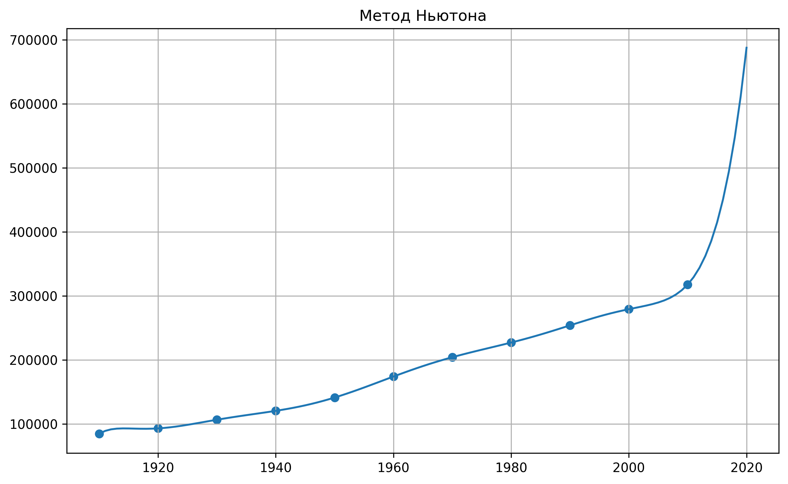
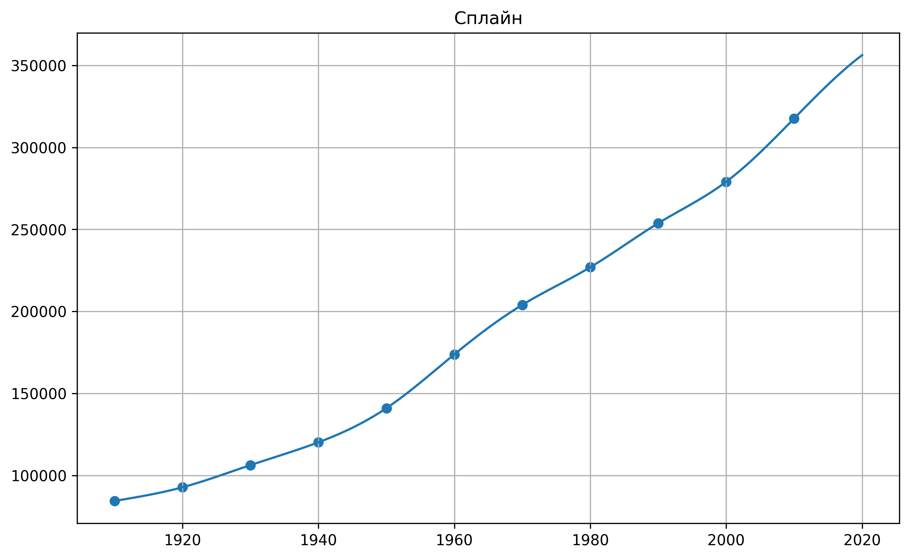
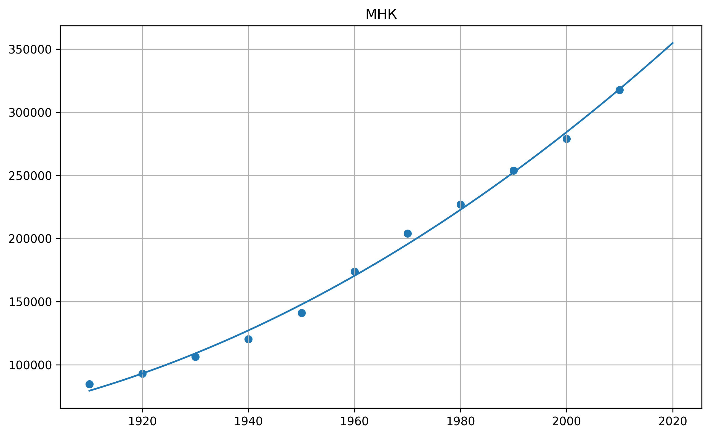

# Экстраполяция численности населения Исландии

Исследовались методы прогнозирования численности населения Исландии на основе исторических данных.  
Для экстраполяции были использованы три численных метода:

1. **Классическая полиномиальная интерполяция по Ньютону**
2. **Кубическая сплайн-интерполяция**  
3. **Метод наименьших квадратов**

Исследование проводилось на данных по населению Исландии каждые 10 лет, начиная с 1910 года и заканчивая 2010 годом.  
Предсказывалась численность населения в 2020 году.

## Данные по населению Исландии (1910–2020)

| Год  | Население |
|------|-----------|
| 1910 | 84,528    |
| 1920 | 92,855    |
| 1930 | 106,360   |
| 1940 | 120,264   |
| 1950 | 141,042   |
| 1960 | 173,855   |
| 1970 | 204,042   |
| 1980 | 226,948   |
| 1990 | 253,785   |
| 2000 | 279,049   |
| 2010 | 317,630   |
| **2020** | **354,042 (референсное значение)** |

Источник данных: https://en.wikipedia.org/wiki/Demographics_of_Iceland  

## Результаты 

| Метод                     | Прогноз | Ошибка относительно референсного |
|---------------------------|---------|-------------------------------|
| **Newton**                | 687,537 | +94.2%                        |
| **Spline**                | 356,211 | +0.61%                        |
| **MLS**  | 354,824 | +0.22%                        |

---

---

## Вывод

Классическая полиномиальная интерполяция по Ньютону дала значительное завышение результата, так как полином высокой степени, проходящий через все точки, ведёт себя нестабильно вне интервала данных, поэтому предсказание оказалась почти в два раза выше реального.

Методы сплайнов и МНК показали очень близкие результаты к референсному значению. Ошибка составила меньше одного процента.

